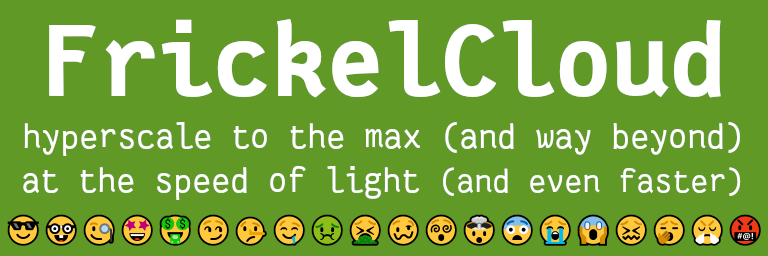

# Repetitionsaufgaben zur Prüfungsvorbereitung (Go 1-4)

Diese Repetitionsaufgaben behandeln die Inhalte der bisherigen vier Go-Blöcke (Git-Repositories und YouTube-Playlisten):

1. Variablen, primitive Datentypen, formatierte Ausgabe
    - [Git-Repository](https://code.frickelbude.ch/m346/go-1-vars-types-output)
    - [YouTube-Playlist](https://www.youtube.com/watch?v=kDhThXZfISk&list=PLoID6wkkuS3fcgdzz48T38c7HHFSFsJtL)
2. Datenstrukturen: Strukturen, Slices, Maps
    - [Git-Repository](https://code.frickelbude.ch/m346/go-2-structs-slices-maps)
    - [YouTube-Playlist](https://www.youtube.com/watch?v=jwjns7HG1fs&list=PLoID6wkkuS3eGWAavAf4rTRVB9oHbgcbv)
3. Kontrollstrukturen: Verzweigungen und Schleifen
    - [Git-Repository](https://code.frickelbude.ch/m346/go-3-branching-loops)
    - [YouTube-Playlist](https://www.youtube.com/watch?v=_DWpLdgVK-o&list=PLoID6wkkuS3f1XZOcOBdKLDZAGVvH21NB)
4. Funktionen
    - [Git-Repository](https://code.frickelbude.ch/m346/go-4-functions)
    - [YouTube-Playlist](https://www.youtube.com/watch?v=gvn9H363zQU&list=PLoID6wkkuS3f0PTinsKMjZVzOMfVBV2Dc)

## Fallbeispiel: FrickelCloud

Die Firma FrickelCloud ist ein innovativer, neuer Player im hart umkämpften IaaS-Cloud-Hyperscaler-Markt. (Auf Deutsch: Bei der FrickelCloud kann man virtuelle Maschinen mieten.)

Beim Bestellen einer solchen VM muss der Kunde folgende Angaben machen (die Optionen mit den monatlichen Preisen dazu sind aufgelistet):

1. Prozessoren (CPU): gewünschte Cores (Anzahl)
    - 1 (1 CHF)
    - 2 (2 CHF)
    - 4 (4 CHF)
    - 8 (8 CHF)
    - 16 (16 CHF)
2. Arbeitsspeicher (RAM): gewünschte Grösse (MB)
    - 512 (1 CHF)
    - 1024 (2 CHF)
    - 2048 (4 CHF)
    - 4096 (8 CHF)
    - 8192 (16 CHF)
    - 16'384 (32 CHF)
    - 32'768 (64 CHF)
3. Speicherplatz (SSD): gewünschte Grösse (GB)
    - 10 (1 CHF)
    - 20 (2 CHF)
    - 40 (3 CHF)
    - 80 (4 CHF)
    - 240 (5 CHF)
    - 500 (6 CHF)
    - 1000 (8 CHF)

Die FrickelCloud verfügt über physische Server mit den folgenden Spezifikationen:

- _Small_
    - CPU: 4 Cores
    - RAM: 32768 MB (~ 32 GB)
    - SSD: 4000 GB (= 4 TB)
- _Medium_
    - CPU: 8 Cores
    - RAM: 65'536 MB (~ 64 GB)
    - SSD: 8000 GB (= 8 TB)
- _Big_
    - CPU: 16 Cores
    - RAM: 131'072 MB (~ 128 GB)
    - SSD: 16'000 GB (= 16 TB)

Auf Basis von diesem Setup sollen folgende drei Prozesse unterstützt werden:

### 1) VM-Provisionierung: Automatisches Einpassen in Hardware

Die von den Kunden bestellten VMs werden auf die physischen Server verteilt. Wenn der Kunde eine Bestellung für eine VM aufgibt, soll folgender Vorgang voll automatisch (_On-Demand Self Service_, erinnern Sie sich?) erfolgen:

1. Es wird geprüft, ob überhaupt einer der physischen Server noch über genügend Ressourcen verfügt, um die VM aufzunehmen.
    - Kann kein Server gefunden werden, wird die Bestellung abgelehnt.
2. Als nächstes soll geprüft werden, welcher der physischen Server anteilsmässig noch die geringste Auslastung hat.
    - Werden mehrere Server mit der gleichen Auslastung ermittelt, kann einfach der erste genommen werden.
3. Zum Schluss wird die Auslastung des physischen Servers um die Spezifikation der bestellen VM erhöht.
    - Dadurch sind nun weniger freie Ressourcen vorhanden.

(Dass der physische Server ebenfalls Ressourcen zur Ausführung benötigt, kann hier ignoriert werden. Es stehen alle Ressourcen für die VMs zur Verfügung.)

Umsetzung: siehe [Aufgabe 1](exercises.md#aufgabe-1-freie-ressourcen-pro-host-berechnen) und [Aufgabe 2](exercises.md#aufgabe-2-vm-in-passendes-host-inventar-aufnehmen)

### 2) VM-Ausserbetriebnahme: Automatische Freigabe der Hardware-Ressourcen

Ein Kunde kann auch eine bestehende VM wieder entfernen lassen. Dieser Vorgang soll ebenfalls voll automatisch erfolgen:

1. Die VM wird anhand ihrer Bezeichnung auf der Hardware gesucht.
    - Kann die VM nicht gefunden werden, wird der Vorgang abgebrochen.
2. Die gefundene VM soll vom physischen Server entfernt werden.
    - Dadurch sinkt die Ressourcenauslastung auf dem betreffenden Server.

Umsetzung: siehe [Aufgabe 3](exercises.md#aufgabe-3-vm-aus-dem-inventar-entfernen)

### 3) VM-Abrechnung: Umsatzberechnung

Die FrickelCloud hat zwar noch keine Buchhaltungsabteilung und erwirtschaftet als Startup auch noch keinen Gewinn. Trotzdem möchte man schon einmal abschätzen können, wie viel Umsatz man mit der aktuellen Auslastung erwirtschaften würde. (Da man bereits Anschaffungs- und Betriebskosten hat, kann man das Preismodell mithilfe der Umsatzberechnung evtl. etwas optimieren.) Die Umsatzberechnung funktioniert folgendermassen:

1. Pro VM kann der Preis anhand der Preisangaben pro CPU, RAM und SSD berechnet werden.
    - VM-Preis = CPU-Kosten + RAM-Kosten + SSD-Kosten
2. Die Preise der einzelnen laufenden VMs auf allen physischen Servern können aufsummiert werden.
    - Gesamtumsatz = Summe aller VM-Preise

Umsetzung: siehe [Aufgabe 4](exercises.md#aufgabe-4-umsatz-berechnen)
